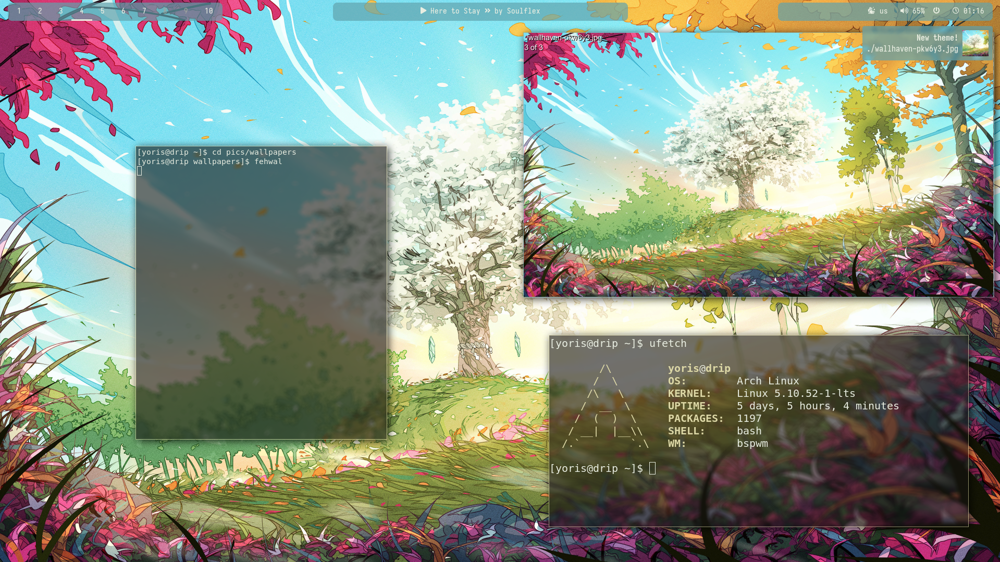

# Yoris' personal desktop dotfiles
## Main Features
* 🎨 Custom script (`fehwal`) for dynamic theming of most programs (Thanks to [pywal](https://github.com/dylanaraps/pywal) and [pywalfox](https://addons.mozilla.org/en-US/firefox/addon/pywalfox/) )
* 💾 Built in local password manager ( [pass](https://www.passwordstore.org/) with the [passmenu]([https://link](https://git.zx2c4.com/password-store/tree/contrib/dmenu)) script modified to work with rofi ) 
* 🎹 Built in music controls and info for most music players in bar ( using [playerctl](https://github.com/altdesktop/playerctl) )
* 💻 [bspwm](https://github.com/baskerville/bspwm) with vim keybinds
* 🖱️ [ranger](https://ranger.github.io/) as default file manager when opening files + [dragon](https://github.com/mwh/dragon) for gui app functionality
* 🔒 Secure screenlocking with [xsecurelock](https://github.com/google/xsecurelock)
* 📷 Custom screenshot script using [scrot](https://github.com/resurrecting-open-source-projects/scrot) and [gimp](https://www.gnu.org/software/gimp/)
## Screenshots

## Installation
**These are my personal dotfiles. It's a highly altered configuration, and they probably will not work for other people, so I don't see a reason to install them for yourself, if you want to take some scripts from here, feel free.**\
\
Clone git repo into your home directory, then install the dotfiles with `./unstow`\
\
Most of the required packages are listed in `./packages`,
however some of them come from the [AUR](https://aur.archlinux.org/).
Refer to the [ Arch Wiki page ](https://wiki.archlinux.org/title/Arch_User_Repository) on how to install from there. 
  

## Additional info

Special thanks to [GNU Stow](https://www.gnu.org/software/stow/) for making it easy to package the dotfiles!\
\
[GNU Stow](https://www.gnu.org/software/stow/) currently has a bug with the --dotfiles option for directories (e.g. `dot-config`). Until [my changes](https://github.com/aspiers/stow/pull/90) are merged upstream, you can get my fixed fork [here.](https://github.com/Yoris1/stow)\
Alternatively, you can make a script that replaces all the instances of `dot-` in filenames with `.` and omit the `--dotfiles` option in the `./unstow` script
## Todo
- [x] add links to all the software in the README
- [x] make sure README is clear
- [ ] make sure `./packages` has all of the necessary packages and nothing more
- [x] mention stow bug workaround

### Before going public
- [ ] make sure there is no personal information in the git backlog